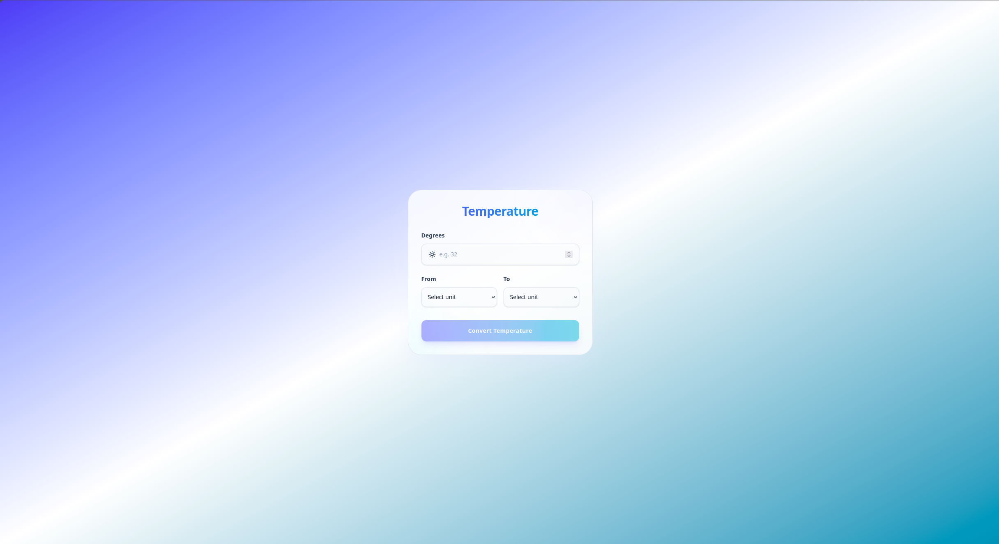

# 🌡️ Temperature Converter

A sleek, responsive, and lightweight temperature conversion application built with **Vanilla JavaScript**, **HTML5**, and **Tailwind CSS**. It provides a simple and interactive interface for converting temperatures between **Celsius**, **Fahrenheit**, and **Kelvin**.



🔗 Live Demo: https://temperature-converter-beta-gold.vercel.app/


---

## ✨ Features

* 🌡️ **Temperature Conversion**: Convert temperatures between Celsius, Fahrenheit, and Kelvin.
* 🔄 **Multiple Conversion Units**: Supports all combinations of the three temperature units.
* ✅ **Form Validation**: The Convert button is only enabled when all required fields are filled.
* 🎯 **Dynamic Results**: Displays the converted temperature instantly after form submission.
* 🧮 **Accurate Calculations**: Uses standard temperature conversion formulas for reliable results.
* 🎨 **Dynamic UI**: Updates the result section dynamically using JavaScript and DOM manipulation.
* 📱 **Responsive Design**: Optimized for desktop, tablet, and mobile screens.
* ⚡ **Vanilla JavaScript**: Built without React or other JavaScript frameworks.

---

## 🛠️ Tech Stack

* **HTML5**: Semantic document structure and form markup.
* **Tailwind CSS**: Utility-first CSS framework for responsive styling and modern UI design.
* **Vanilla JavaScript (ES6+)**: DOM manipulation, form handling, validation, event handling, and temperature conversion logic.
* **DOM API**: Used to read user input, manage form state, and dynamically update the result.

---

## ⚙️ Functionality

The application allows users to enter a temperature value, select the source unit, and select the target unit.

When the user fills in all three fields, the **Convert** button becomes enabled. Submitting the form triggers the conversion process and displays the result below the form.

The conversion logic first converts the input temperature to **Celsius** as an intermediate value. The Celsius value is then converted into the selected target unit.

The supported units are:

* **Celsius**
* **Fahrenheit**
* **Kelvin**

---

## 📁 Project Structure

```text
Temperature-Converter/
├── assets/
│   ├── js/
│   │   └── app.js          # Temperature conversion logic & event handling
│   │
│   └── style/
│       ├── input.css       # Tailwind CSS source file
│       └── output.css      # Compiled CSS stylesheet
│
├── index.html              # Main HTML document
├── package.json            # Project dependencies & scripts
├── package-lock.json       # Dependency lock file
├── preview.png             # Project preview image
├── favicon.svg             # Project favicon image
└── README.md               # Project documentation
```

---

## 🚀 How It Works

1. Enter a temperature value in the input field.
2. Select the unit to convert **from**.
3. Select the unit to convert **to**.
4. The Convert button becomes enabled when all fields are filled.
5. Submit the form to start the conversion.
6. The input value is converted to Celsius first.
7. The Celsius value is converted to the selected target unit.
8. The converted temperature is displayed in the result section.

---

## 🧠 What I Practiced

* DOM selection and manipulation
* Form submission handling
* Handling `input` and `change` events
* Form validation
* Conditionally enabling and disabling buttons
* Working with `<input>` and `<select>` elements
* Type conversion using `Number()`
* `switch` statements
* Function parameters and return values
* Temperature conversion formulas
* Dynamic UI updates
* Managing DOM state with JavaScript
* Building interactive components with Vanilla JavaScript

---

## 📄 License

This project is licensed under the **MIT License**.
